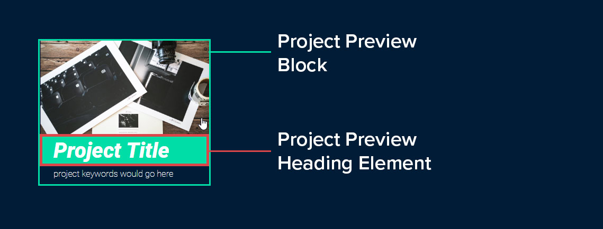
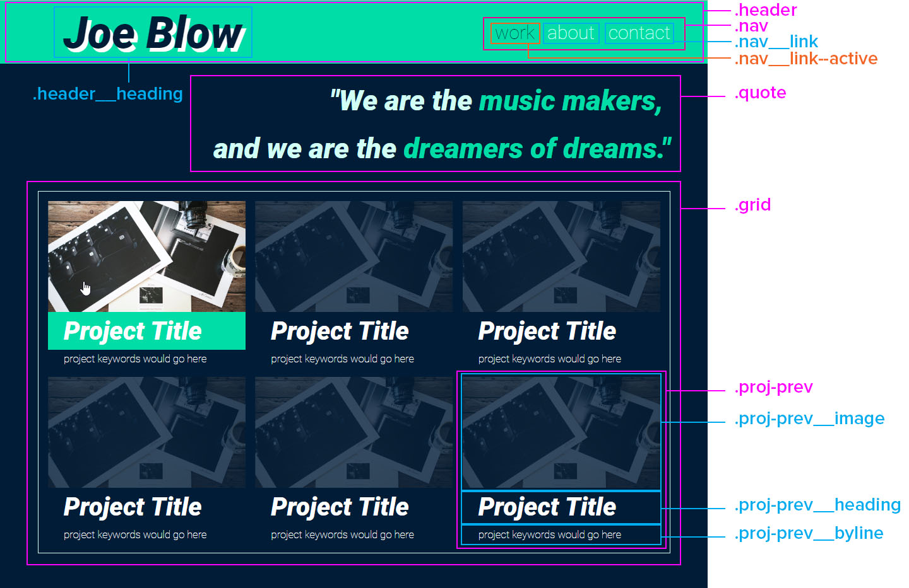

# Structure your CSS
How should you go about writing your CSS to make sure that it’s clean and maintainable? **CSS doesn’t have a rigid structure**, which can make it hard to keep a clean and maintainable codebase. By **creating and implementing your own structure**, you can keep keep an unwieldy CSS in check. Step one is **finding categories**. Scroll through your CSSand you will likely begin to notice heaps of repeated rules. For example, all of your buttons are using the same padding and font color, and nearly all of them have the same background color. This means that **you have repeated your code**. 

There’s a concept in programming known as the **DRY** principle, which goes like this: **Don’t repeat yourself**. Those piles of repeated CSS rules are preventing you from achieving a DRY codebase, and are wreaking havoc on its maintainability by making it **cumbersome to update values**. 

Begin by **refactoring**, or in other words, cleaning up your code. Start by looking through all of your selectors and **finding commonalities**.

## Example
Let’s say that you notice that **all your buttons have the same** background color, color, and padding. You might end up with something like:
```css
.btn {
    background-color: #001534;
    color: #15DEA5;
    padding: 1.5rem;
}
.btn-wide { width: 100%; }
.btn-rounded { border-radius: 3rem; }
```
So instead of your HTML looking like this:
```html
<button class="btn"> OK </button>
```
Your markup looks like: 
```html
<button class="btn btn-rounded btn-wide"> OK </button>
```

What we’ve just done is called **separation of concerns**. In the `.btn` selector, we’ve defined the very essence of our buttons, and nothing more. **One selector = one set of basic rules**. Every button in your code will have these qualities. In the `.btn-wide` and `.btn-rounded` selectors, we’ve added additional rules that, when combined with `.btn`, will modify the button. 

By separating concerns, your codebase instantly becomes **easier to maintain**; instead of relying on  `Ctrl+F` and Find-and-Replace to update your buttons’ padding, you **only need to change the value on a single rule set**.

## Note
There are no hard, set-fast rules for architecting your CSS - only educated opinions. The means and methods of this course are **battle-tested, highly adopted practices within the industry**, whose foundations will serve you well in creating a clean, maintainable CSS codebase on projects **of all scales**.  The most important takeaway in building a strong, maintainable front-end code is to **sit down, make a plan, and stick with it**.  Instead of looking through your existing code like we did in the example above, you need to think about how to structure your code **before you even write a line**. We showing you how to implement a **well-defined, highly-semantic naming convention for your selectors**. 

# What is specificity?
Let’s look at an example.  Say you have a button element with an  id  of submit-button  and a class of button:
```html
<div id="submit-button" class="button">Click Here!</div>
```
And in your CSS file, you’ve assigned a different background color to each, as well as the button element:
 CSS
```css
#submit-button { background-color: #15DEA5; }
.button { background-color: #DB464B; }
```
So, when you look at your button **in a browser, what color will it be**? The answer lies in each of the **selectors’ specificity**. When an element has conflicting rules applied, such as multiple background colors, the browser will apply the **rule from the most specific of the selectors**.
## The four horsemen of specificity
The browser lumps CSS rules into four categories:
- Inline styles: 
```html
<div style="background-color:#15DEA5;">Click Here!</div>
```
- IDs:
```html
<style> #submit-button { background-color: #15DEA5; } </style>
<div id="submit-button">Click Here!</div>
```
- Classes, pseudo-classes, attributes:
```html
<style> .button { background-color: #DB464B; } </style>
<div class="button">Click Here!</div>
```
- Elements and pseudo-elements:
```html
<style> div { background-color: #DB464B; } </style>
<div>Click Here!</div>
```
When the browser is deciding which of the conflicting rules to apply, it tallies up the number of categories being implemented by a selector. So our three selectors would be tallied as follows:
`#submit-button {...}` :
|Inline|ID|Class|Element|
|-|-|-|-|
|0|**1**|0|0|

Once the tallying is done, the browser starts by looking at the scores in the **left column**, because **inline selectors are the most specific**. If there’s a selector with a higher score, the browser will apply its style. **If there’s a tie, it moves right to the next column and does the same thing.** **Comparison column by column.**

**What if you were to add a second class to the button selector?**
```html
<style>.button.submit-button { background-color: #DB464B; }</style>
<div class="button submit-button">Click Here!</div>
```
That would change its specificity to:
|Inline|ID|Class|Element|
|-|-|-|-|
|0|0|**2**|0|

Although it might seem like the new double class selector of `.button.submit-button` would be more specific, it still loses out to `#submit-button`. Remember, **the browser works from left to right**, and since `#submit-button` has a **higher score in the ID column, the browser stops there**. It **doesn’t matter if a selector has two classes, or 200**, an ID selector will always be more specific than a selector of classes.

But what if you really want to use the color from the class selector? Instead of a second class, you could add the  id  to it as well:
```html
<style>
    #submit-button {background-color: #15DEA5;}
    #submit-button.button { background-color: #DB464B;}
</style>
<div id="submit-button" class="button">Click Here!</div>
```
Now you have: `#submit-button {...}`  :
|Inline|ID|Class|Element|
|-|-|-|-|
|0|**1**|0|0|

`#submit-button.button {...}` :
|Inline|ID|Class|Element|
|-|-|-|-|
|0|**1**|**1**|0|

Now **there is a tie for the ID column, so the browser moves right to the class column**, where  `.button` wins 1-0, and the browser applies its background color to the button.

You will often want to **override** certain attributes with a modifying selector, rather than writing out a ton of specific selectors. This helps make your code more **modular and reusable**. ID selectors are difficult and messy to override, thats why **avoid using ID's**. By sticking with classes to create your CSS selectors, you ensure that they have a low but consistent specificity. This makes conflicting rules easier to predict and manage.

**What happens if the browser goes through the columns and ends in a tie?**
```html
<style>
.submit {background-color: #15DEA5;}
.button { background-color: #DB464B;}
</style>
<div class="button submit">Click Here!</div>
```
Both `.submit` and `.button` have the same score, which selector wins out? In the case of a tie, the browser selects the **last selector to have been declared in css**, not last used in html code.

# BEM (Block Element Modifier) selectors naming
Being able to look at a class name and know what it does and how it interacts with other elements will save a lot of time and energy in the future. Enter BEM, a CSS naming methodology that will help you do just that. 

BEM is an acronym for **block, element, modifier**. By **assigning each selector you write to one of those three categories**, you are able to **define their functionality and hierarchical relationships**, while naming them appropriately.

## BLOCK
A **block is a component, or section, of a page that can stand alone and function independently** from the rest of the page. This could be a **header, container, menu, or button**. The key is that you could strip away all of the surrounding website and it would still make sense. For example: text string like "Project X"  wouldn't make much sense, but if it is string with picture of project and plus small annotation, and we have some this groups after another, then it is look like a blocks! You **name a block by describing its purpose**. Let’s name the block selector for our project preview  `.proj-prev`.
```css
.proj-prev { color: #fff; margin-bottom: .25rem; }
```
Now remember that text for the project title that wouldn’t work on its own? Since it **doesn’t function independently**, but rather forms an **integral part** of the block, it's an **element** of the **block**.



The **name of an element should identify its parent block, followed by double underscores** (also known as “dunders”), and then the element’s purpose. Since it's the heading for the project preview, we'll name it  `.proj-prev__heading`  and assign the following rule set:
```css
.proj-prev__heading {
    font-size: 4rem;
    padding-left: 2.5rem;
    margin: 0;
    line-height: 6rem;
}
```
That leaves us with **modifiers** which, as its name indicates, **changes the appearance of a block or element**. Think of them as selectors that **produce different versions of blocks and elements**. Need to change the size, color, typography, etc., of an element, but otherwise, leave it as it is? That’s what modifiers are for! 

You’ll create a modifier for your `.proj-prev` block. To name the modifier, first identify what it’s modifying, followed by two dashes, and then the visual style of the modifier. Since you are modifying the `.proj-prev` block to have a mint font color, you can call it `.proj-prev--mint`, and style it as follows:
```css
.proj-prev--mint { color: #15DEA5; }
```
```html
<section class="proj-prev proj-prev--mint">
    <div class="proj-prev__image"></div>
    <h1 class="proj-prev__heading">Project Title</h1>
    <p class="proj-prev__byline">project keywords would go here</p>
</section>
```
Here is our entire contact page, broken down into its blocks, elements, and modifiers:



```html
<nav class="nav">
    <ul>
        <li class="nav__link nav__link--active">work</li>
        <li class="nav__link"> <a href="/about.html">about</a> </li>
        <li class="nav__link"> <a href="/contact.html">contact</a>  </li>
    </ul>
</nav>
```
**BEM selectors are always implemented as classes.** To be able to apply modifiers with consistent results, you need to ensure that **your selectors have as low a specificity as possible**. If you were to assign the block selector as an ID, rather than a class, its specificity would inherently trump all the modifying selectors assigned as a class.

```css
.nav {
    padding-right: 6rem;
    text-align: right;
}
.nav__link {
    display: inline;
    font-size: 3rem;
    padding-left: 1.5rem;
}
.nav__link a {
    text-decoration: none;
    color: #D6FFF5;
}
.nav__link--active { color: #001534; }
.nav__link a:hover { color: #fff; }
```
While we are attempting to keep the selector specificity low, pseudo-classes, such as `:hover` and combinators, like the descendant combinator, are perfectly acceptable to use. It’s true that they will increase the specificity of the selector, but they can help yield cleaner, more legible code by **reducing the need to assign a class to every single element on the page**.

# CSS Preprocessors
## Creating a hierarchy in your code
Wouldn’t it be awesome if you could **write your CSS like you write your HTML**? Rather than a long list of CSS selectors, you could **indent** your elements and modifiers within their parent block, like this:
```css
.nav {
    padding-right: 6rem;
    flex: 2 1 auto;
    text-align: right;
        .nav__link {
            display: inline;
            font-size: 3rem;
            padding-left: 1.5rem;
                .nav__link--active {
                    color: #001534;
                }
        }
}
```
Having a **visual hierarchy** not only makes things much easier to read, but it also helps to keep everything contained. By forcing an object to exist within **relative blocks**, it makes it much easier read and maintain your codebase; rather than scrolling around a document for random elements from a block of code, you simply need to locate that particular block and **all of its relative elements will be there with it**. With **CSS preprocessors**, you can write your code in a more visually coherent manner through features like **nesting**. Preprocessors give you the best of both worlds by **compiling its syntax into standard CSS for browsers to read and render**.
- **Variables** allow you to **store often repeated values**, such as colors and measurements, into a single element and reuse it throughout your code. Imagine that you’ve used a shade of green hundreds of times throughout a site, and now need to change it to red. With variables, you’d only have to change it once.
```scss
$mint: #15DEA5;
.header { background-color: $mint }
```
- **Loops**, which automate repetitive tasks such as creating a bunch of color modifiers, save you a lot of tedious coding while maintaining a much smaller codebase to manage.
```scss
$colours:(
    mint: #15DEA5,
    navy: #001534,
);
@each $colour, $hex in $colours {
    .btn--#{$colour} { background-color: $hex; }
}
```
```css
.btn--mint { background-color: #15DEA5; }
.btn--navy { background-color: #001534; }
```
- **Logical operations** allow you to write a single block of code that you can use in different circumstances and have it react accordingly, such as determining the font color based on a background color. For example, if the background color is dark blue, make the font white.
```scss
@if (lightness(#15DEA5) > 25%) {
    .header {
        color: #fff;
        background-color: $mint;
    }
}@else{
    .header {
        color: #000;
        background-color: $mint;
    }   
}
```
```css
.header {
    color: #fff;
    background-color: #15DEA5;
}
```
## Vendors
There are a lot of CSS preprocessors out there, but the three most prominent are **SASS** (Syntactically Awesome Style Sheets), **Less**, and **Stylus**. However, on the whole, **they all do the same thing in a very similar manner**. In this course, **we’ll be using Sass**, why?, you are far more likely to run into Sass in a professional environment, and it only makes sense to learn with the tool that you are most likely use in your day to day life.
### SASS
#### Syntax
There are **two different ways to write Sass**, which can be denoted by their file extensions:  `.sass`  and `.scss`. Up until now, all of the CSS precompiler snippets you have seen have been done using Sass' **`.scss`** syntax. It looks an awful lot **like regular CSS with some extra Sass sugar** sprinkled on top. The  `.scss`  syntax is rooted in the standard CSS syntax. In fact, **you can write standard CSS within a  `.scss`  file seamlessly**. The syntax that is specific to  `.scss`  only surfaces when you start to use Sass tools, such as variables and functions, where you **prefix variables with dollar signs ($)**, and **functionality keywords with at signs (@)**.
```scss
.class-selector{
    color: white;
    background-color: black;
}
```

But you also have the option of writing in the `.sass` syntax:
```sass
.class-selector
    color: white
    background-color: black
```
While  `.scss`  looks a lot like regular CSS,  **`.sass`  has a far more concise syntax**. `.scss`  syntax is similar to CSS syntax. `.scss`  is more commonly used than the more concise `.sass`  syntax, when someone talks about Sass, they are nearly always talking about `.scss`. The odds of ever needing to write `.sass` professionally are unlikely.
                                                                                           
#### Nesting
When you nest a block in Sass, it **creates an individual CSS selector with the parent selector appended**.
Sass:
```scss
ul {
    list-style: none;
    li {
        display: inline;
    }
}
```       
Resulting css:
```css
ul { list-style: none; }
ul li { display: inline; }
```              

```css
/*css*/
.parent { background-color: #15DEA5; }
.parent .descendant { color: #fff; } /* if descendand */
.parent > .child { color: #D6FFF5; } /* if child */
.parent + .adjacent { color: #001534; } /* if immediately preceded */
```                        
```scss
/*scss*/
.parent {
    background-color: #15DEA5;
    .descendant { color: #fff; }
    >.child { color: #D6FFF5; }
    +.adjacent { color: #001534; }
}
```             

You need to add a  `li:hover`  pseudo-class to your  `<li>`s to provide visual feedback and better the user experience:
```scss
/*sccs*/
li {
    display: inline;
    :hover { color: #001534; }
}
```                  
Well, that not work:
```css
/*result css*/
li :hover { color: #001534; }
```
**Nesting in Sass creates combinators** (with spaces). Sass has a **special character to concatenate** the parent and child selectors: the ampersand (**&**)!  Prefixing a nested selector with an ampersand will directly join it to the parent selector without any combinators.
```scss
/*scss*/
li {
    display: inline;
    &:hover { color: #001534; }
}
```                  
```css
/*result css*/
li:hover { color: #001534; }
```

There’s **no physical limit as to how deeply you can nest within Sass**. Remember, **when you nest selectors, you increase the specificity of the compiled selectors**. So, if you nest too deeply, you’ll end up with selectors of incredibly high specificity, making them extremely difficult to modify or override. It also greatly hinders the re-usability of your code. And that defeats the purpose of using a preprocessor at all!

Rather than trying to replicate the hierarchy of the HTML, it is **better to write nested selectors only relative to the root selector**. It **won’t represent the HTML structure as clearly**, but it helps to ensure a low specificity in your codebase while maintaining flexibility and modularity. In practice, **if you find yourself nesting more than two levels deep, stop and reassess how you are structuring your block**.

#### BEM with SASS
```scss
/*scss*/
.block{
    background-color: #15DEA5;
    .block__element { color: #fff; }
}
```
You end up with a `.block` selector with a specificity of `0/0/1/0`, and a `.block__element` selector with a specificity of `0/0/2/0`. Let’s say you then needed to create a variation of your  `block__element`  , changing its background color. This means creating a  `block__element--modifier`  selector, but since you’ve elevated the specificity of your element, you must also make sure that you are increasing your modifiers by at least as much, or they will fail to have any effect.
```scss
.block{
    background-color: #15DEA5;
    .block__element { color: #fff; }
    .block__element--modifier { background-color: #001534; }
}
```
```css
/*result css*/
.block { background-color: #15DEA5; }
.block .block__element { color: #fff; }
.block .block__element--modifier { background-color: #001534; }
```
What you need is a way to **nest in Sass without messing up the principles of BEM**? 

Child doesn’t have to be a selector; it can be plain old text as well! In our nest for `.block__element` , let’s replace the `block` part with an ampersand:
```scss
.block{
    background-color: #15DEA5;
    &__element { color: #fff; }
}
```
```css
/*result css*/
.block { background-color: #15DEA5; }
.block__element { color: #fff; }
```
Now we have an element selector with the flat specificity of `0/0/1/0`, just like we wanted.
```scss
.block{
    background-color: #15DEA5;
    &__element {
        color: #fff;
        &--modifier { background-color: #001534; }
    }
}
```

**Save specify, when you need**:
```scss
.btn {
    display: inline-block;
    background: #15DEA5;
    &--disabled {
        background: grey;
    }
    &--outline {
        background: transparent;
        border: 2px solid #15DEA5;
        &.btn--disabled{
            border: 2px solid grey;
        }
    }
}
```
`.btn`,`.btn--outline`,`.btn--disabled`, `.btn--outline.btn--disabled`. Technically, selector #4 has a specificity of two, but `.btn--disabled` **also works without**  `.btn--outline`, making it a modular, reusable  system, where you can add or remove the class and have the element behave as we'd expect.
```html
<!-- make both buttons disabled -->
<div class="btn btn--disabled">Solid Button</div>
<div class="btn btn--outline btn--disabled">Outline Button</div>
```
Let’s say you decide that you want your first button to be outlined like the second. All you need to do is apply the outline modifier:
```html
<div class="btn btn--disabled btn--outline">Solid Button</div>
<div class="btn btn--outline btn--disabled">Outline Button</div>
```
Thanks to the **heightened specificity** of the outlined/disabled combo, **adding the same class in two situations produces two separate, but predictable results**.